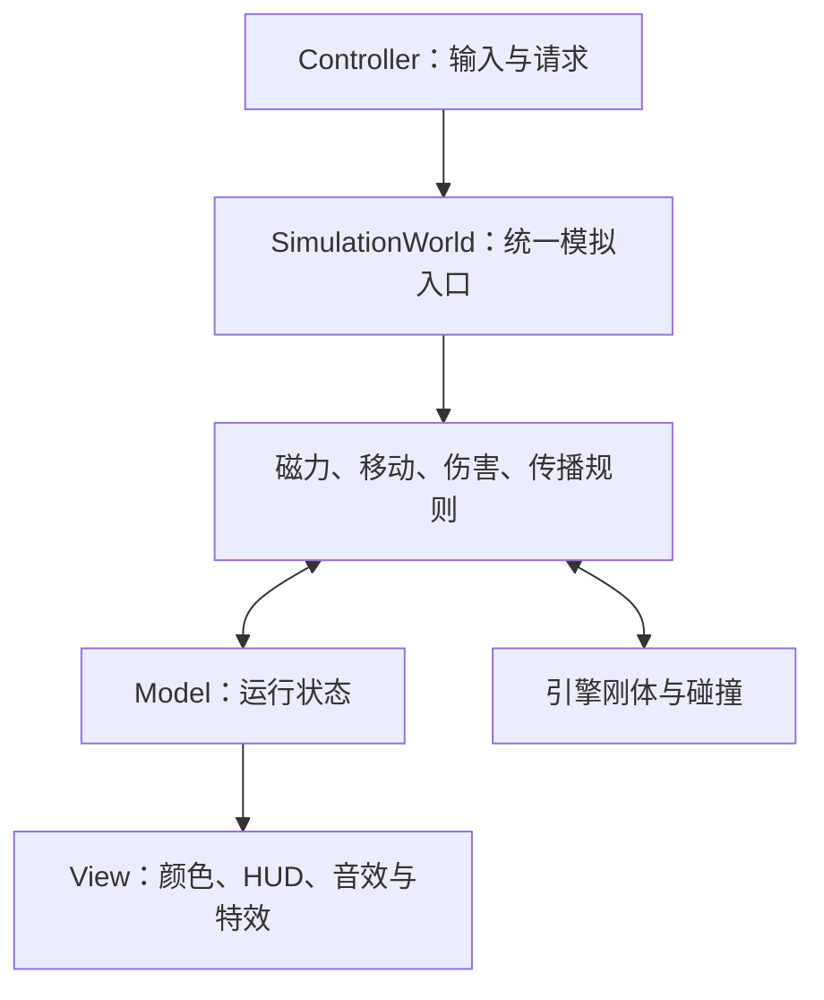

# 极性失控 / Polarity Unleashed — 技术架构

> 引擎：团结引擎 1.10.1  
> 架构：借用 MVC 分层思路，结合统一模拟系统  
> 版本：v0.2，2026-10-08  
> 对应玩法：[玩法设计 v0.3](./玩法设计.md)  
> 状态：技术实现设计。基础白盒、最小斜俯视表现、极性状态、唯一模拟入口、基础磁力、玩家移动与有限标记、受磁力影响的追击敌人已完成并验收；接触传播及后续规则尚未实施。进度见[实施步骤](./实施步骤.md)，证据见[实施记录](./实施记录.md)。

## 1. 技术目标与边界

本项目为约 15 天的 Game Jam 游戏。使用原生 GameObject、MonoBehaviour、Rigidbody2D、Collider2D 和 ScriptableObject，配合少量普通 C# 类组织玩法。借用 MVC 的职责划分，不要求每个对象都有独立的 Model、View、Controller，也不默认引入第三方框架。

最重要的目标是让磁力、追击、接触传播和伤害按明确顺序执行，同时方便修改参数、观察结果和快速重试。表现采用带立体感的 2D 斜俯视，物理保持 XY 平面；将外观、阴影和排序放在 View 层，不让视觉高度改变模拟规则。

当前玩法基线：

- 敌人与箱子可以主动标记，也可以作为接触传播的来源与接收者。
- 炮弹默认负极，参与磁力，但不可主动标记，不传播也不接收极性。
- 玩家、固定炮台、墙、尖刺不参与磁力和极性传播。
- 原型每关默认 3 次主动标记，首次赋极和改色均消耗 1 次。
- 传播免费，只影响无极性目标；已有极性不会被接触覆盖。
- 不支持主动清除极性，不自动恢复次数。
- 主题核心是“传播改变运动，运动改变接触，接触改变传播”。有限次数用于突出玩家的关键干预，并不单独创造涌现。

规则变化先同步玩法文档，再修改实现。本技术文档不保证某个涌现案例必然出现，须通过原型确认。

## 2. MVC 分层与模拟系统

| 部分 | 职责 | 示例 |
| --- | --- | --- |
| Model：运行状态 | 保存游戏当前事实 | 极性、生命、存活、关卡阶段、剩余次数 |
| View：表现 | 读取结果并显示，不决定玩法规则 | 颜色、极性符号、HUD、音效、特效 |
| Controller：输入与流程 | 接收玩家意图，提交请求，管理关卡流程 | 移动输入、选中目标、标记、暂停、重试 |
| Simulation：规则 | 校验请求，统一计算关系和修改状态 | 磁力、追击、传播、伤害、死亡 |
| Engine Adapter：引擎连接 | 提供刚体、碰撞体与实际接触数据 | PolarityBody、ContactRecorder |

依赖原则：

1. 输入提交请求，模拟校验并修改状态，表现读取结果。
2. View 不直接扣次数、改极性、改生命或控制传播。
3. 传播直接进入规则层，不经过玩家标记入口，因此不会消耗次数。
4. 系统之间的重要调用显式执行；事件主要用于通知表现，不用事件总线串起整个模拟步骤。
5. 位置、速度、质量以 Rigidbody2D 为权威来源，不另建一份可能失同步的物理 Model。



允许 PolarityBody 同时承载极性状态和刚体引用，这对当前项目足够实用。不要为满足严格 MVC 给每个箱子创建三套对象或复杂接口。

## 3. 模块职责与实现形式

| 模块 | 形式 | 负责 | 不负责 |
| --- | --- | --- | --- |
| LevelController | MonoBehaviour | 创建关卡、关卡阶段、重试、根据结算结果决定胜负 | 逐对磁力和传播计算 |
| SimulationWorld | MonoBehaviour | 注册对象、请求队列、统一固定步、系统调用与结果提交 | 编写颜色、音效与菜单逻辑 |
| LevelState | 普通 C# 类 | 当前阶段、剩余标记次数、活动敌人数 | 引用 UI 与修改配置资产 |
| PolarityBody | MonoBehaviour | 稳定 ID、权限、极性、刚体引用、注册生命周期 | 自行寻找邻居或在回调中传播 |
| Health | MonoBehaviour | 当前生命与有效/死亡状态，受规则层控制 | 自行重复结算碰撞伤害 |
| PlayerController | MonoBehaviour | 读取移动、慢速、暂停与重试意图 | 自行推进物理 |
| MarkingController | MonoBehaviour | 选中目标、显示候选、提交标记请求 | 提前扣次数或直接改色 |
| EnemyMotor | MonoBehaviour | 追击方向与驱动力，由 World 调用 | 用独立 FixedUpdate 覆盖最终速度 |
| Turret | MonoBehaviour | 预警、瞄准锁定、炮弹生成，由 World 调用 | 独立运行不受暂停控制的计时 |
| Projectile | MonoBehaviour | 炮弹属性、已消耗状态、销毁请求 | 在碰撞回调中直接重复伤害 |
| ContactRecorder | MonoBehaviour | 把碰撞回调中的数值复制到本步记录 | 修改生命、极性或立即 Destroy |
| MagnetismSystem | 普通 C# 类 | 成对计算力与墙体遮挡 | 选择玩家目标、播放特效 |
| PropagationSystem | 普通 C# 类 | 根据快照和接触生成传播计划、解决冲突 | 原地修改正在遍历的状态 |
| DamageSystem | 普通 C# 类 | 阈值、无敌/冷却、命中、死亡结果 | 自行推进物理 |
| PolarityView / HUDView | MonoBehaviour | 订阅结果、显示极性与界面 | 反向决定模拟规则 |
| YSortView / FacingView | MonoBehaviour | 按脚下 Y 排序、更新朝向外观 | 移动刚体、改变碰撞或极性 |

这些是职责边界，不是要求第一天创建全部脚本。World 中先用小方法实现规则，原型成立后再将磁力与传播提取为普通类，避免提前增加大量样板代码。

## 4. 建议目录与场景结构

```text
Assets/Polarity/
  Scripts/
    Model/          Polarity、LevelState、MarkRequest、传播/伤害结果数据
    Controllers/    PlayerController、MarkingController、LevelController
    Simulation/     SimulationWorld、MagnetismSystem、PropagationSystem、DamageSystem
    Entities/       PolarityBody、Health、EnemyMotor、Turret、Projectile、ContactRecorder
    Views/          PolarityView、HUDView、YSortView、FacingView、音效与特效
    Config/         GameplayConfig、LevelDefinition
  Prefabs/
    Actors/         Player、Enemy、Crate、Turret、Projectile
    Levels/         各关卡房间
    UI/             HUD、结算界面
  Configs/          参数与关卡配置资产
  Scenes/          Game.scene
  Art/
  Audio/
```

首版用一个 Game 场景装载当前关卡 Prefab，关卡是完整房间，直接在编辑器中摆放。无需自制关卡编辑器或随机地图系统。

```text
Game
├─ LevelController
├─ SimulationWorld
├─ MainCamera
├─ LevelRoot（当前房间实例）
│  ├─ Player
│  ├─ Enemies
│  ├─ Crates
│  ├─ Turrets
│  └─ WallsAndHazards
└─ Canvas / EventSystem
```

首版将运行状态留在场景内，不让 World、对象列表或关卡状态通过 DontDestroyOnLoad 跨关存在。启动时由 LevelController 建立并传入依赖，避免各系统反复调用 FindObjectOfType。

## 5. 数据、配置与状态修改入口

### 5.1 核心状态

```csharp
public enum Polarity
{
    Neutral,
    Positive,
    Negative
}

public enum LevelPhase
{
    Ready,
    Running,
    Paused,
    Won,
    Lost
}
```

PolarityBody 保存 CurrentPolarity、CanMark、CanSpread、CanReceive、BodyId 和刚体引用。极性对外只读，修改方法只由规则层调用。Health 保存生命；有效状态至少能区分正常、已死亡/已消耗、已注销。

LevelState 保存当前阶段、总预算和剩余预算。活动敌人数通过注册与死亡更新，不把炮台计入敌人目标。

### 5.2 状态修改边界

- 主动标记：World 消费 MarkRequest，完整校验后扣预算并改色。
- 接触传播：PropagationSystem 生成结果，World 统一提交极性，不扣预算。
- 伤害：DamageSystem 计算结果，World 统一应用生命与死亡。
- 移动：统一模拟阶段通过 Rigidbody2D 施力或按玩家移动方案驱动。

不用给同一个极性建立两份状态，例如模型里保存一份、View 上再保存一份可独立修改的颜色含义。View 的颜色必须由真实极性派生。

### 5.3 配置资产

| 配置 | 内容 |
| --- | --- |
| GameplayConfig | 磁力强度/半径、标记距离、速度与加速度上限、伤害阈值、受伤间隔、慢速倍率 |
| LevelDefinition | 关卡 Prefab、初始标记预算、教学提示与关卡顺序信息 |
| 对象 Prefab | 质量、阻尼、碰撞体、权限、初始极性、敌人移动与炮台参数 |

ScriptableObject 用于可复用的配置；运行时复制初始值，不写回剩余次数、当前极性和生命。避免重试或其他对象受共享资产变化影响。

## 6. 引擎物理设置

### 6.1 刚体与碰撞

- 敌人、箱子、炮弹使用 Dynamic Rigidbody2D，gravityScale = 0。
- 敌人使用脚下占地 CircleCollider2D，箱子使用底部占地 BoxCollider2D，首版均冻结物理旋转。朝向通过视觉子对象的方向帧表现，箱子先保持固定斜俯视外观，不把立体绘制的整张图片随物理旋转。
- 玩家先用 Dynamic 刚体并冻结旋转，通过独立的可控移动力保持手感；不给玩家挂可磁化的 PolarityBody。若后续改为 Kinematic，须重新验证推箱子和接触行为。
- 墙和固定炮台使用静态实体碰撞体；尖刺可使用触发区，伤害走统一结算。
- 炮弹考虑 Continuous 碰撞检测，仍需测试最高速度下是否穿透；不要仅提高速度上限。
- 初期采用低弹性物理材质，让高速撞击清楚，避免无意义反复弹跳。
- 通过刚体移动动态物体，不在每帧直接写 Transform.position；初始化和重试重建属于单独的生命周期操作。

团结 1.10 Rigidbody2D 文档使用 velocity、drag、angularDrag 等 API 名称。不要直接照搬 Unity 6 的 linearVelocity / linearDamping 示例而不核对版本。[Rigidbody2D API](https://docs.unity.cn/cn/tuanjiemanual/ScriptReference/Rigidbody2D.html)

### 6.2 Layer 建议

Player、Enemy、Crate、Projectile、Wall、Turret、Hazard 分层。Layer 用于碰撞过滤和目标查询，极性仍存为运行状态，不通过动态切换 Layer 表示正负极。

保留 Enemy↔Enemy、Enemy↔Crate、Crate↔Crate 实体碰撞，这是传播基础。保留 Projectile 与敌人、玩家、箱子、墙、炮台的命中关系；首版可关闭 Projectile↔Projectile 碰撞以降低噪声。Hazard 与玩家和敌人产生触发检测。

标记查询只检索 Enemy 与 Crate；墙体遮挡另用 Wall 掩码检测。磁力遮挡也只查询配置指定的阻挡层，箱子不阻断磁力。

### 6.3 斜俯视对象结构与锚点

相机继续为正交相机，位于例如 (0, 0, -10)，正对 XY 平面。不要为模拟斜俯视而倾斜相机或把物理改成 XZ 平面。斜俯视角度体现在精灵素材的顶面、立面和身体绘制上。

建议迁移现有 Prefab 到以下结构，保留根对象的物理位置、刚体参数与 Layer：

    BodyRoot（脚下占地锚点）
    ├─ Rigidbody2D / Collider2D / 状态与规则组件
    ├─ GroundShadow（SpriteRenderer，仅贴地表现）
    └─ VisualRoot（SortingGroup，排序由 BodyRoot.y 决定）
       ├─ BodySprite（角色或箱子的可见主体）
       ├─ DetailSprite（可选的顶面、侧面或方向细节）
       └─ PolarityMarker（极性符号、选中轮廓）

- BodyRoot 定义脚下接触点/占地锚点，刚体和碰撞体使用地面尺寸；视觉素材的接地参考位置与该锚点对齐。
- 图片 Pivot 可使用接地位置；若现有素材 Pivot 不合适，用子对象局部偏移对齐，不移动物理根对象补偿美术高度。
- 角色身体与箱子立面在画面 Y 方向向上延伸，视觉缩放只改子对象，不整体缩放 BodyRoot 导致碰撞尺寸变化。
- GroundShadow 是 VisualRoot 的同级对象，不包含在其 SortingGroup 中，确保一直处于物体下方。
- FacingView 根据移动方向或瞄准方向切换图片/视觉细节；普通机器人优先方向帧，不能把有立面的整张精灵持续旋转 360 度。
- 墙体可拆为实体占地与视觉立面。长墙按适当段落组织外观；前景墙降低高度或淡化，碰撞和磁力遮挡保持不变。

### 6.4 前后排序与渲染层

首版采用一个明确的排序方案：YSortView 根据脚下 BodyRoot 的 Y 更新 VisualRoot 的 SortingGroup.sortingOrder，地面 Y 越小，排序值越大，画得越靠前。

建议原型公式：order = -RoundToInt(footY × 100)。

排序值限定在有效范围；相同 Y 的重叠对象可用小而固定的偏置稳定显示，不用随机值。YSortView 在 LateUpdate 更新只影响画面；刚体位置以模拟结果为准，若使用插值，核对用于显示的脚下位置与实际画面同步。

建立 Sorting Layer 顺序：Ground → GroundShadow → World → Effects。角色、箱子、炮台和需要前后遮挡的墙体立面共享 World，不能把墙永久放在所有角色上方。炮弹主体也使用一致的前后规则；轨迹/闪光是否进入 Effects 依可读性验证。

SortingGroup 将同一对象的多张精灵一起与外部对象排序，组内再确定身体、细节和符号的相对顺序。[SortingGroup 官方说明](https://docs.unity3d.com/2022.3/Documentation/Manual/class-SortingGroup.html)

Sorting Layer 是渲染顺序，Physics Layer 是碰撞与查询过滤，两者分别设置。不要用物理 Layer 区分前后，也不要用不断改变 Z 位置代替排序。

本方案主要由显式 sortingOrder 控制前后，不再另加一套相互冲突的自动轴排序。以后若改为 Transparency Sort Axis，必须同步调整组的锚点和 order；当前不同时实现两套方案。[2D 排序规则](https://docs.unity3d.com/2022.3/Documentation/Manual/2DSorting.html)

### 6.5 可见外观选中与物理校验

脚下碰撞体通常小于图片，因此 MarkingController 不能只靠物理点选范围选目标。首版从已注册、可标记的对象中检查主体精灵的屏幕包围范围，按实际 World 排序选择最前方候选，忽略阴影、标记和装饰。细致像素级命中可后续增加。

只选择实际可见的主体；若墙体视觉覆盖了鼠标位置，优先拒绝被遮挡候选。高物体的多个可见片段共同代表同一 BodyRoot，不创建多个独立标记目标。鼠标点击图片后提交根对象 ID，World 仍按玩家与目标的脚下位置检查距离和墙体遮挡，不按头部图片位置校验。

磁力与传播只使用刚体及实际接触；视觉图片重叠不构成传播。选中时可以在地面显示与 Collider2D 对应的占地提示，帮助玩家理解接触与伤害范围。

## 7. 统一模拟步与执行顺序

### 7.1 首版选择

由 SimulationWorld 在 FixedUpdate 中推进一次固定步，Physics2D.simulationMode 设置为 SimulationMode2D.Script。场景中只有一个推进物理的入口，不能同时启用自动模拟或再调用第二次 Simulate。

引擎仍计算刚体运动、碰撞和冲量；我们只控制前后阶段。系统内部使用同一固定模拟时间，首版 fixedDeltaTime 可从 0.02 秒开始。

团结 1.10 官方说明：Physics2D.Simulate 不会主动调用 FixedUpdate；关闭自动物理后，其他脚本的 FixedUpdate 仍会被引擎调用。因此 EnemyMotor、Turret 等不能再用各自 FixedUpdate 重复施力或结算。[Simulate API](https://docs.unity.cn/cn/tuanjiemanual/ScriptReference/Physics2D.Simulate.html)

### 7.2 每步阶段

| 顺序 | 阶段 | 说明 |
| --- | --- | --- |
| 1 | 校验当前关卡状态，消费标记请求 | 按请求顺序校验，修改极性并扣次数 |
| 2 | 更新炮台计时并生成本步炮弹 | 新炮弹明确初始化并注册，避免在遍历列表时插入 |
| 3 | 建立本步对象与极性快照 | 包含有效新对象及本步主动标记；此后传播只读此快照 |
| 4 | 更新移动与追击，计算并施加磁力 | 通过刚体施力，累计和限制异常力 |
| 5 | Physics2D.Simulate(fixedStep) | 推进一次物理；碰撞回调只收集数据 |
| 6 | 合并实际接触与命中记录 | 合并短暂碰撞与持续接触，归一化并去重 |
| 7 | 统一结算伤害、死亡与炮弹消耗 | 标记无效对象，立即从规则参与者中排除 |
| 8 | 根据本步快照生成传播计划 | 同时排除第 7 阶段失效的来源和接收者 |
| 9 | 统一提交传播，再处理注销与销毁 | 新极性在下一物理步参与力和下一轮传播 |
| 10 | 检查胜负，发布本步结果事件 | 表现读取最终结果，不反向改规则 |

以下仅为执行顺序伪代码，不是已实现或可直接编译的脚本：

```text
FixedUpdate:
    若非 Running，返回
    ConsumeMarkRequests()
    TickTurretsAndRegisterSpawns(step)
    CaptureBodyAndPolaritySnapshot()
    TickMovementAndApplyMagnetism(step)
    SimulatePhysics(step)
    CollectAndMergeContacts()
    ResolveDamageAndMarkInactive()
    PlanPropagationFromSnapshot()
    CommitPropagation()
    FlushRemovals()
    ResolveLevelOutcome()
    PublishEvents()
```

物理模拟失败时，不继续提交本步传播与胜负，并输出调试错误。不能在碰撞回调中递归调用 Simulate。

### 7.3 注册与 ID

- 房间中的静态生成顺序采用关卡中明确的列表或编号，启动时检查重复 ID。
- 动态炮弹使用 World 中的递增编号，重试时重置。
- 不依赖 GetInstanceID 作为重试间稳定的传播冲突顺序。
- 对象注销、死亡和生成集中在约定阶段处理，不在成对循环中修改列表。
- 关闭或销毁时取消注册；已死亡状态先阻止参与规则，再执行 Destroy。

固定步和稳定顺序用于提高同场景复现能力，不承诺跨设备、跨引擎版本完全确定的物理结果，也不据此设计锁步联网。

## 8. 输入与主动标记

Update 读取输入边沿、鼠标位置和按键状态。移动方向缓存给模拟步；鼠标点击转换为带目标 ID、所选极性和顺序号的 MarkRequest。每次点击只入队一次，不能每个 FixedUpdate 都重复消费同一点击。

输入初期可使用引擎自带 Input API，并集中放在 Controller 内；若项目已使用 Input System，只替换输入读取，不改模拟接口。

### 8.1 标记校验

World 在消费请求时重新检查：

1. 关卡正在运行，目标仍有效。
2. 目标是允许标记的敌人或箱子，所选极性不是 Neutral。
3. 当前距离满足要求，玩家与目标间无墙体阻挡。
4. 若已经是相同极性，返回无变化，不扣次数。
5. 若预算不足，拒绝并给出反馈。
6. 否则原子地修改极性、扣 1 次，并记录结果事件。

首次赋极与改色经过同一入口；无效点击、同色点击、传播都不扣次数。同一步多个有效请求按顺序处理，不能因都读到旧预算而超额标记。

选中轮廓是预览，不代表请求必定成功。点击 UI 时不发世界标记请求；暂停、胜负或重试时清空尚未消费的请求，避免恢复后执行旧点击。

## 9. 磁力与敌人移动

### 9.1 成对磁力

维护有效 PolarityBody 列表，采用 i < j 的成对遍历。先检查极性、距离和墙体遮挡，再计算一次力，对 A/B 施加方向相反、大小相等的力。

```text
distance >= radius，或任一对象 Neutral：无磁力
距离在范围内：magnitude = strength × (1 − distance / radius)
异极：A 朝 B 受力，B 朝 A 受力
同极：方向反转
```

源力有上限，中心重合使用稳定分离方向避免除零。累加后设置合理加速度与全局安全速度上限；速度上限属于游戏化处理，不保证严格能量守恒。

持续磁力使用 AddForce(force, ForceMode2D.Force)，不额外乘 deltaTime。Force 模式由物理系统按时间与质量积分。[AddForce API](https://docs.unity.cn/cn/tuanjiemanual/ScriptReference/Rigidbody2D.AddForce.html)

首版同屏几十个对象直接两两遍历即可。需要优化时先测量，再考虑近邻查询；不要每步 FindObjectsOfType，也不急于引入 Jobs、ECS 或空间树。

### 9.2 敌人追击

EnemyMotor 提供朝玩家的有限驱动力或转向加速度，由 World 在施力阶段调用。追击会尝试恢复方向，但不能把最终速度每步强制写成固定追击速度。

区分追击驱动力上限与物理安全速度上限。前者决定敌人抵抗磁力的能力，后者只防止极端速度，不应将正常弹射立即压回步行速度。

先验证开放场地直接追击和简单避障，再按关卡需求增加绕墙逻辑。不要开局就做复杂状态机或全套寻路。

## 10. 接触采集与传播结算

### 10.1 接触数据

ContactRecorder 在 OnCollisionEnter2D / OnCollisionStay2D 中只复制对象引用/ID、接触点、法向、相对速度和冲量等本步需要的数值，不保留可能被复用的 Collision2D 对象供以后读取。

Simulate 完成后，对相关刚体使用 GetContacts 获取持续接触，与回调捕获的短暂接触合并。不能只查重叠，也不能只用 Enter：

- 只查重叠不能可靠表示实体接触。
- 只用 Enter 会漏掉“已经贴靠，后来才被玩家标记”的传播。
- 只查模拟后的当前接触可能漏掉撞击后已弹开的短暂接触。

成对数据按较小/较大稳定 ID 归一化；同一物理步双边回调或多个碰撞体不能重复传播、重复计伤。接触缓冲区复用，容量用满时检查扩容，避免漏掉关系。

实体传播使用非 Trigger 接触。尖刺 Trigger 的伤害数据单独收集，不作为传播接触。[GetContacts](https://docs.unity3d.com/2022.3/Documentation/ScriptReference/Rigidbody2D.GetContacts.html)、[ContactPoint2D](https://docs.unity.cn/cn/tuanjiemanual/ScriptReference/ContactPoint2D.html)

### 10.2 快照与传播计划

只处理 Enemy/Crate 权限满足的有效双方。读取第 7.2 节第 3 阶段的快照：

- 一方有极性、另一方 Neutral：生成接收者获得来源极性的候选。
- 两方 Neutral：无候选。
- 两方均已有极性：无覆盖。
- 炮弹、玩家、固定物体：不参与。

先计算全部候选，再统一写入状态。新获得极性的对象不会在本轮立即成为新的传播来源。

```text
本轮快照：A 正极，B Neutral，C Neutral
本轮接触：A—B，B—C
本轮结果：B 获得正极，C 仍 Neutral
下一轮：若 B—C 仍接触，C 才能获得正极
```

主动改色只改被选对象，不追溯改变它此前传播出去的极性。第一版不增加“源头改变，全网同步”的关系系统。

### 10.3 同时遇到不同来源

沿用玩法 v0.3 的原型规则：Neutral 接收者同一步遇到正负来源时，选择本步接触冲量更大的来源，接近相同时按稳定来源 ID 决定。

每个接触对的冲量统计须去掉双边回调重复，不把同一碰撞复制两次后相加。一次碰撞含多个接触点时可聚合法向冲量；不同记录重复描述同一碰撞时采用统一去重结果。持续静止接触可能都接近零，此时稳定 ID 兜底。

每个接收者每轮最多提交一个极性与一个来源事件。传播表现显示实际来源，调试界面显示冲突候选。若冲突频繁且不易理解，先调整布局，再讨论是否修改玩法规则。

## 11. 伤害、炮弹与死亡

- 碰撞伤害使用记录下来的接触法向相对速度，不用模拟后已经变慢的速度反推撞击力度。
- 低速贴靠不计伤。碰撞对去重，并有短暂伤害冷却，防止每步扣血。
- 玩家受击无敌时间由模拟时间计时；敌人碰撞冷却和尖刺伤害节奏也由规则层统一处理。
- 炮弹命中按直接伤害处理，碰到箱子、墙或固定障碍则消耗；同一炮弹本步只能消费一次，不能通过双边回调产生重复命中或范围伤害。
- 多个命中候选需要显式归并。首版记录回调发生顺序，取第一个有效命中；复现检查须覆盖角落和多对象接触，不把回调顺序当作跨平台确定性保证。
- 敌人与敌人高速碰撞可分别伤害双方，但每方只结算一次，不因双方回调重复扣血。
- 一批伤害结算后，将生命归零对象标记为无效；本步传播排除死亡来源和接收者。没有带极性尸体继续传播。
- 箱子首版不可摧毁，炮台不计入敌人存活数量。
- 注销和 Destroy 统一延后处理；先保证逻辑已停止，不能等 Destroy 真正执行后才认为对象死亡。

同一步玩家死亡且最后一个敌人死亡时，原型采用玩家死亡优先判负，作为明确的流程决策；若需要宽容的胜利判定，可在试玩后修改。敌人清空且玩家存活时判胜，并停止后续危险模拟。

## 12. 表现事件、慢速与生命周期

### 12.1 事件与 View

事件至少区分：主动标记、极性传播、预算变化、受伤、死亡、关卡阶段变化。事件包含实际来源/目标与必要位置，不要求特效再次查询已经销毁的对象。

PolarityView 初始化时主动读取当前状态，之后订阅变化事件。不能只等第一次事件，否则初始负极炮弹可能没有正确颜色。HUD 同样先显示初始预算和生命。

View 在 OnEnable 订阅，在 OnDisable 取消订阅。采用普通 C# event 或明确引用即可，不需要全局字符串消息中心。传播结果统一提交后再发通知，避免表现回调影响尚未完成的规则结算。

传播动画体现结果，不反过来延迟或修改传播判定。慢速帮助观察，但一个物理步一跳只保证执行顺序，不保证画面上的传播一定足够慢；可读性仍需实际测试。

### 12.2 时间管理

由一个明确入口管理时间状态：Running 时倍率为 1 或慢速倍率，Paused 时为 0，退出暂停恢复当前合理倍率。其余脚本不各自修改 timeScale。

首版保持 fixedDeltaTime 不随慢速变化。timeScale 降低后单位真实时间内的模拟步数减少，但每步模拟时间保持一致；不要再对 Simulate 的步长、磁力或追击力重复乘慢速倍率。炮台与伤害计时使用模拟时间，UI 动画可用 unscaledDeltaTime。[timeScale 说明](https://docs.unity.cn/cn/tuanjiemanual/ScriptReference/Time-timeScale.html)

输入 Controller 在 Update 处理暂停、重试与菜单，因为 timeScale = 0 时不能依赖 FixedUpdate 接收恢复指令。失败、胜利时通过关卡阶段停止 World 模拟，菜单仍可响应。

### 12.3 重试与退出

首版重试采用重新加载 Game 场景。若要保留所选关卡编号，仅传递该编号，不保留旧 LevelState、对象列表和物理记录。

重试/切关前清空请求与事件，恢复正常时间倍率；新场景重新初始化预算、生命、ID、炮台计时、接触和冷却记录。World 退出时恢复它接管前的 simulationMode 和时间设置，避免影响编辑器中其他场景测试。场景加载过程中暂停模拟，待新房间全部注册后再进入 Ready/Running。

固定房间初始位置和炮台节奏，避免每次重试默认随机化。真正需要随机的装饰不要影响物理与传播。

## 13. 原型实施顺序与验证

### 13.1 实施顺序

1. 复用已完成的 Game 场景和白盒；先做最小 VisualRoot/阴影/脚下锚点适配，再建立 World 验证受力和碰撞。
2. 加入输入请求、三个标记机会和只读 View，验证有效操作才扣次数。
3. 加入六个敌人与简单通道，实现快照传播和接触去重。
4. 验证不同起点/时机改变传播与群体运动，确认主题核心是否成立。
5. 加入伤害、死亡、胜负与快速重试。
6. 加入默认负极炮弹、炮台和慢速观察。
7. 拆分已稳定的规则类，做教学与综合关卡，再打磨视听反馈。

### 13.2 值得做的规则测试

传播计划和请求校验尽量保留为可独立验证的普通逻辑。用少量针对真实风险的测试，而非为每个字段写测试：

| 验证 | 预期 |
| --- | --- |
| A 有极性，B/C Neutral，接触 A—B—C | 第一轮只有 B 获得极性 |
| 同目标已有极性再接触不同极性来源 | 不被覆盖 |
| 一个 Neutral 同时接触正负来源 | 只提交一个稳定结果 |
| 同一接触收到双方回调 | 不重复伤害、不重复传播 |
| 同一步提交多个标记请求 | 不超额扣预算，无效或同色请求不计次 |
| 本步碰撞致死 | 死亡对象不再参与本步传播 |

### 13.3 引擎内验证

- 已贴靠对象被主动标记后，持续接触可以传播。
- 炮弹不可标记、不传播，但受磁力影响。
- 敌人追击不会抵消磁力；高速弹射不会被步行限速立即抹掉。
- 慢速、暂停和重试没有重复模拟、旧请求或倍率残留。
- 箱子挡弹、炮弹命中与尖刺伤害符合玩法规则。
- 同一布局只改变起点或时机，可以形成至少两种可解释、可复现、可利用的整体局面。

调试视图优先显示 BodyId、极性、速度、接触对、传播来源、剩余次数和物理步编号。磁力范围与连线用 Gizmos，避免调试文字混入正式界面。

## 14. 当前不引入与待验证事项

首版不引入 ECS/DOTS、复杂依赖注入、通用命令框架、全局消息总线、资源热更新、联网、自动回放、自制物理或自制关卡编辑器。对象池只在炮弹与特效频繁创建确实造成问题时增加。

待验证：

- 团结 1.10.1 核心脚本、输入与斜俯视排序的运行验证；已完成的是原有基础白盒，不代表本版表现已实现。
- 磁力、追击、质量、阻尼之间是否产生有趣的整体行为。
- 默认三次预算是否适合各关卡，是否存在多个稳定解法。
- 快照传播的实际节奏是否可读，冲突规则是否易理解。
- 手动模拟下持续接触、短暂撞击和表现插值是否正确。
- 敌人带动箱子能否作为次级战术成立。

框架服务于这些验证。原型没有证明反馈有趣之前，不扩大内容或增加更多抽象层。

## 15. v0.2 修订要点

- 将带立体感的 2D 斜俯视明确为表现方案，继续使用 Rigidbody2D 与 XY 物理。
- 新增 BodyRoot/VisualRoot 分离、脚下占地、GroundShadow、YSortView、FacingView 与 SortingGroup 约定。
- 区分点击可见身体的选择范围和 World 的物理距离、遮挡校验。
- 场景命名按当前团结工程采用 Game.scene。
- 现有 MVC 和统一模拟顺序保持，新增表现不直接写入玩法状态。
